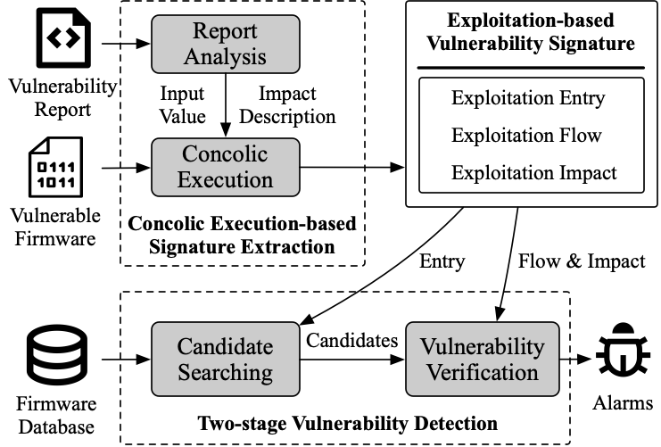

# FirmRec

[](https://github.com/ucsb-seclab/karonte/blob/master/LICENSE)

Firmrec is a recurring vulnerability detector for embedded firmware.

## Overview



## Research Paper

We present our approach and the findings of this work in the following research paper (available [here](public/FirmRec-Paper.pdf)):

**Accurate and Efficient Recurring Vulnerability Detection for IoT Firmware.**
Haoyu Xiao, Yuan Zhang, Minghang Shen, Chaoyang Lin, Can Zhang, Shengli Liu, Min Yang.
In Proceedings of the 31st ACM Conference on Computer and Communications Security (CCS), Salt Lake City, USA, October 14-18, 2024.

If you use FirmRec for your academic work, we would appreciate citations using this Bibtex entry:

```bibtex
@inproceedings{firmrec,
 author       = {Haoyu Xiao and Yuan Zhang and Minghang Shen and Chaoyang Lin and Can Zhang and Shengli Liu and Min Yang},
 title        = {{Accurate and Efficient Recurring Vulnerability Detection for IoT Firmware}},
 booktitle    = {Proceedings of the 31st ACM Conference on Computer and Communications Security (CCS)},
 series       = {CCS'24},
 year         = {2024},
 month        = {October},
 location     = {Salt Lake City, U.S.A.},
 publisher    = {ACM},
}
```

## Usage

The current FirmRec release is meant to be used with [docker](https://www.docker.com). So firstly, you need to build firmrec docker with following steps:

1. Build the base docker image with `docker build -f Dockerfile-base -t firmrec-base .`. This command build up all dependencies and input entry identification module.
2. Build working docker image with `make build`, which just copies firmrec source code into a new docker images. When FirmRec code or `config.yaml` is modified, this command should be executed to update the docker image.

Then, prepare inputs for firmrec. The docker container uses `inout` directory as a data directory to read inputs from and store outputs into. We've prepared a sample archive of inout. You can download [this archive](https://github.com/seclab-fudan/FirmRec/releases/download/init/inout.tar.gz) and extract it to the project root.

Here are things that have been prepared in inout directory for running FirmRec:

1. Known vulnerability information at `inout/vuln_info`
2. Target firmware images at `inout/firmware/images`
3. Task list specified by `inout/experiment.json`

To use LLM for input entry searching during vulnerability detection, it is required to configure `llm_key`, `llm_url`, and `llm_model` fields in `config.yaml`.

After input preparation, you can run FirmRec with previously built docker image with the following steps:

1. Spawn a docker shell by executing `make start` under project root directory.
2. Execute `python -m firmrec.pipeline all` in the docker shell. This command will automatically finish all FirmRec steps and show vulnerability detection results. More details of `firmrec.pipeline` are presented in [firmrec/pipeline/README.md](firmrec/pipeline/README.md).


## Dataset

The firmware dataset is available at [Firmware Dataset](https://mega.nz/file/rdVyBYhT#JxVNKjgGEQTIxMUJMjRZEljyNNakJGgU8trmN5KU5L4)

## Vulnerabilities

We list CVEs detected by FirmRec at [VULNS.md](VULNS.md)

## License

See the [LICENSE](LICENSE) file for more details.
